# PETCARE 360
### Autor: Nikolas Martinez Rivera

---

## 🌱 Estrategia de Ramas (GitFlow)

Para mantener un flujo de trabajo ordenado en equipo, usaremos **GitFlow adaptado**:

- **`main`**
    - Rama principal de producción.
    - Contiene únicamente código estable y listo para despliegue.
    - Solo recibe merges desde `release/*` o `hotfix/*`.

- **`develop`**
    - Rama de integración.
    - Contiene el código más actualizado y aprobado de las nuevas funcionalidades.
    - Todas las ramas de trabajo (`feature/*`, `fix/*`) se integran aquí mediante *pull requests*.

- **`feature/*`**
    - Para nuevas funcionalidades.
    - Se crean a partir de `develop`.
    - Convención de nombre:
      ```
      feature/<nombre-corto-descriptivo>
      ```
      Ejemplo:  
      `feature/login-usuarios`  
      `feature/api-pets`

- **`fix/*`**
    - Para corrección de bugs detectados en `develop`.
    - Convención de nombre:
      ```
      fix/<descripcion-breve>
      ```
      Ejemplo:  
      `fix/carga-datos`

- **`release/*`**
    - Preparación de versiones antes de pasar a producción.
    - Se crean desde `develop`.
    - Convención:
      ```
      release/<version>
      ```
      Ejemplo:  
      `release/1.0.0`

- **`hotfix/*`**
    - Correcciones urgentes en producción (`main`).
    - Convención:
      ```
      hotfix/<descripcion>
      ```
      Ejemplo:  
      `hotfix/error-arranque`

### 🦐 Estructura commits 
 - `tipo(<área>): mensaje breve en presente`
### Tipos principales:
- **feat** → Nueva funcionalidad.
- **fix** → Corrección de bug.
- **docs** → Cambios en documentación.
- **style** → Formato (espacios, indentación, sin cambios de lógica).
- **refactor** → Cambios de código que no corrigen bug ni añaden funcionalidad.
- **test** → Añadir o modificar pruebas.
- **chore** → Tareas varias (build, configuración, dependencias).

### Ejemplos:

- feat(auth): agregar endpoint de login
- fix(api): corregir error en validación de mascotas
- docs(readme): añadir sección de instalación
- refactor(service): optimizar consulta a base de datos

---

## ⚙️ Tecnologías

- **Java 17**
- **Spring Boot 3.5.6**
- **Maven** (gestión de dependencias y build)
- **Lombok** (reducción de código boilerplate)
- **JUnit 5 / Spring Boot Test** (pruebas unitarias e integración)
- **Springdoc OpenAPI** (documentación Swagger UI)
- **Jacoco** (cobertura de código)
- **SonarQube** (análisis estático de calidad de código)

---

## 📦 Dependencias Clave

- `spring-boot-starter`
- `lombok`
- `spring-boot-starter-test`
- `junit-jupiter`
- `springdoc-openapi-starter-webmvc-ui`
- `jacoco-maven-plugin`
- `sonar-maven-plugin`

---

## 🚀 Requisitos Previos

- Java 17 instalado
- Maven 3.9+ instalado (o usar el wrapper `./mvnw`)
- IDE recomendado: IntelliJ IDEA o Eclipse con soporte para Spring Boot

---

## ▶️ Ejecución del Proyecto

1. Clonar el repositorio:
   ```
   git clone https://github.com/NikoMAR3/GRUPO_AZUL_PETCARE360_DOSW_2025-2.git

2. Utilizar comando de Maven

    `mvn clean compile`

---

## 📚 Explicacion Diagramas


Para el diagrama de contexto, pues se obvio el hecho de tener una base de datos y 
pues tal como aparece en el diagrama se presentan los usuarios del sistema
y que hacen con el.


👩‍💼 `Recepcionista`

- Registrar nuevos clientes en el sistema.

- Registrar las mascotas asociadas a cada cliente.

- Programar citas médicas para las mascotas.

- Asignar veterinarios a las citas médicas.

- Generar facturas por los servicios ofrecidos.

- Registrar ventas realizadas en la clínica.

- Consultar el calendario de citas agendadas.

- Cancelar citas programadas.

- Consultar el historial de facturas emitidas.

👨‍⚕️ `Veterinario`

- Consultar las citas médicas asignadas.

- Cancelar citas, si es necesario.

- Revisar facturas relacionadas con sus servicios.

👤 `Cliente`

- Consultar las citas médicas de sus mascotas.

- Cancelar citas previamente agendadas.

- Revisar sus facturas y estados de cuenta.


En justificacion se ahonda un poco sobre el diagrama de clases.

## 🐢 Diagramas de Secuencia 

- scheduleAppointment
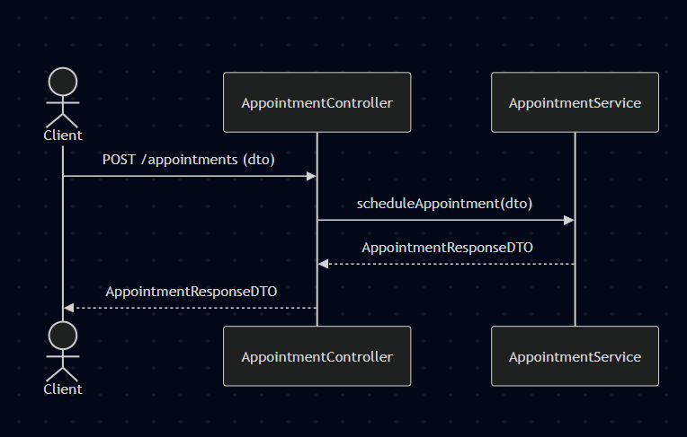

- getAppointment
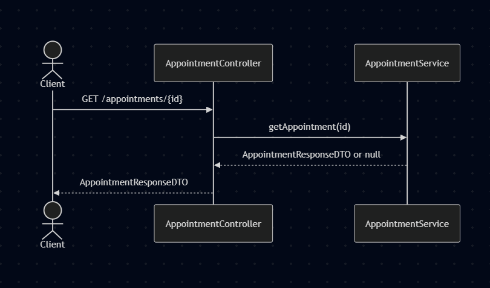

- cancelAppointment
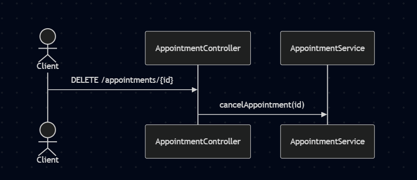

- getAppointmentsByVeterinarian
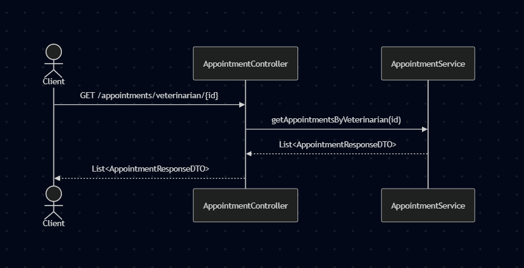

- getAppointmentsByPet
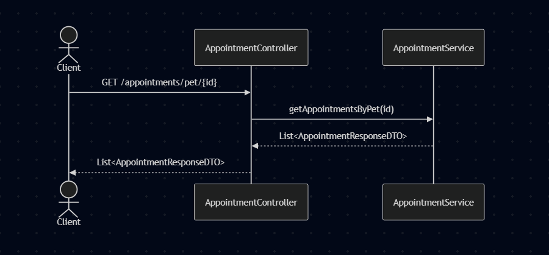


## Backlog

`LINK:`
https://nikolas.atlassian.net/jira/software/projects/PC360/boards/34/backlog?atlOrigin=eyJpIjoiNzM3MTc0MGE2ZjgzNGQ4MmEyZmUwNGRkOWFhYmNkMjkiLCJwIjoiaiJ9

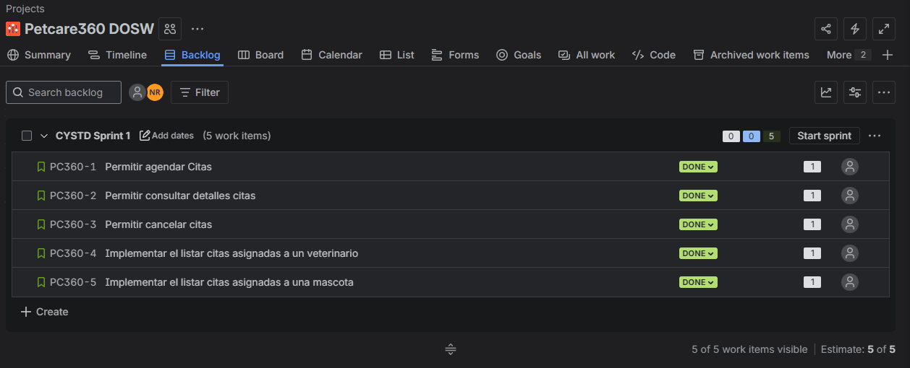

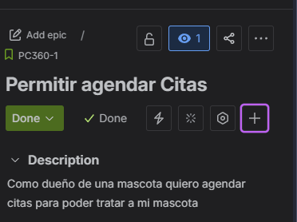
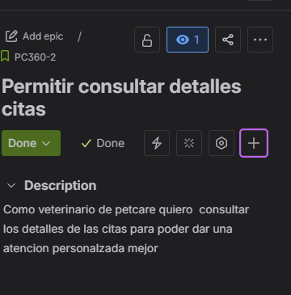
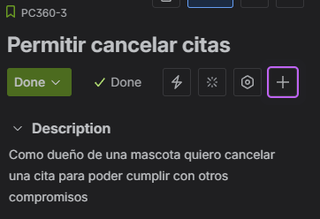
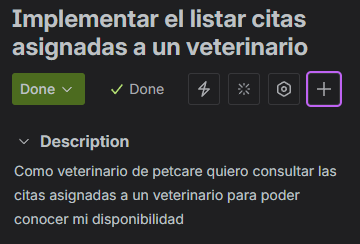
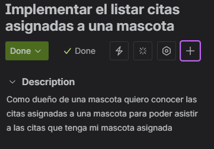

## 🧩 Patrones 

Como tal el unico patron que pense en utilizar fue el Patron Builder.

### Justificacion

`Builder`

El uso de Builder para la creacion de las facturas es debido a su propia definicion; permite armar un objeto complejo(en este caso la factura)
paso por paso, en este caso pues cada producto o servicio que venda Petcare360 a sus clientes.

La aplicacion de principios solid en mi diseño se puede evidenciar con el uso de la clase
abstracta sell por ejemplo, lo cual permite Open/closed de lo que ofrece petcare, asi mismo cada servicio esta
bien separado, asegurando el Single Responsability, aunque en este diagrama de clases preliminar 
no se evidencia uso de interfaces para ver el tema de interface segregation, el uso del patron builder
seguido al pie de la letra con lo academico podria usar ese principio.